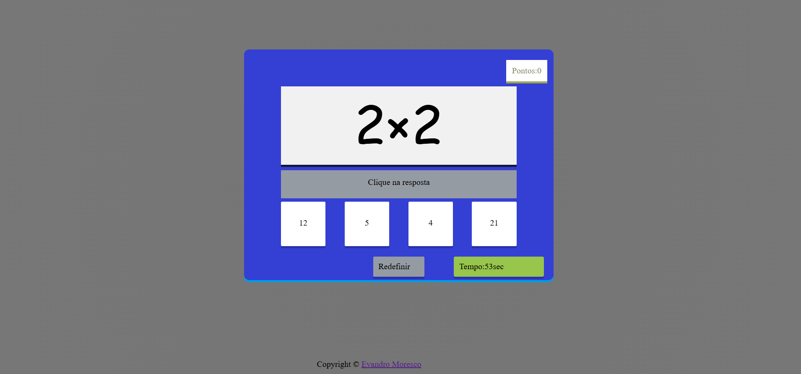

# ✖️ Calculadora Racha-Cuca

Jogo web educativo e interativo para treinar **multiplicação** de forma dinâmica e divertida. Com sistema de pontuação, timer e alternativas de resposta, o jogo desafia o raciocínio rápido e ajuda no aprendizado das tabuadas de forma lúdica.

## 🖥️ Preview



> 🔗 **Acesse o projeto online:** [mor3sco.github.io/calculadora-rachacuca](https://mor3sco.github.io/rachacuca/)

---

## 🎮 Como Jogar

1. Uma **equação de multiplicação** é exibida na tela (ex: `9 × 5`)
2. Abaixo aparecem **4 alternativas**, sendo apenas uma correta
3. Clique na resposta certa antes que o tempo acabe!
4. **Acertou** → ganha tempo extra e soma pontos
5. **Errou** → o timer acelera, diminuindo mais rápido
6. O jogo termina quando o tempo chega a zero

---

## ✨ Funcionalidades

- ➗ **Equações geradas aleatoriamente** a cada rodada
- 4️⃣ **Múltipla escolha** com apenas uma resposta correta
- ⏱️ **Timer dinâmico** que reage ao desempenho do jogador
- ✅ **Acerto** → tempo bônus adicionado
- ❌ **Erro** → timer acelera como penalidade
- 🏆 **Sistema de pontuação** em tempo real
- 🔄 Botão **Redefinir** para reiniciar o jogo a qualquer momento

---

## 🛠️ Tecnologias Utilizadas

| Tecnologia | Descrição |
|------------|-----------|
|  | Estrutura e marcação da interface do jogo |
|  | Estilização e layout visual |
|  | Lógica do jogo, timer, pontuação e geração de alternativas |

---

## 📁 Estrutura do Projeto

```
calculadora-rachacuca/
├── rachacuca/
│   ├── index.html      # Estrutura do jogo
│   ├── style.css       # Estilização da interface
│   └── app.js          # Lógica do jogo completa
├── .gitignore
└── README.md           # Documentação do projeto
```

---

## ⚙️ Como Funciona por Baixo dos Panos

- **Geração das alternativas:** o JavaScript gera um resultado correto e 3 distratores aleatórios, embaralhando as 4 opções a cada rodada
- **Timer dinâmico:** um `setInterval` controla a contagem regressiva, com velocidade ajustada conforme o desempenho
- **Sistema de penalidade:** ao errar, o intervalo do timer é reduzido, fazendo o tempo correr mais rápido
- **Sistema de bônus:** ao acertar, segundos são somados ao tempo restante, recompensando o bom desempenho
- **Pontuação:** cada acerto incrementa o placar exibido em tempo real

---

## 🚀 Como Executar Localmente

1. Clone o repositório:
   ```bash
   git clone https://github.com/mor3sco/calculadora-rachacuca.git
   ```

2. Acesse a pasta do projeto:
   ```bash
   cd calculadora-rachacuca/rachacuca
   ```

3. Abra o arquivo `index.html` no seu navegador — sem necessidade de servidor ou instalação.

---

## 💡 Aprendizados

Este projeto foi desenvolvido com foco em **lógica de jogos** e **interatividade no front-end**:

- Criação de **lógica de game loop** com JavaScript puro
- Controle de **intervalos e timers** dinâmicos com `setInterval` e `clearInterval`
- **Geração e embaralhamento** de alternativas aleatórias
- Implementação de **sistema de recompensa e penalidade** baseado em desempenho
- Desenvolvimento de um produto com **propósito educacional** real

---

## 🎯 Objetivo

O projeto nasceu com o propósito de ajudar pessoas com **dificuldade em multiplicação** a aprenderem de forma leve e divertida, estimulando o raciocínio rápido através da gamificação.

---

<p align="center">
  Feito por <a href="https://github.com/mor3sco"><strong>Evandro Moresco</strong></a>
</p>
